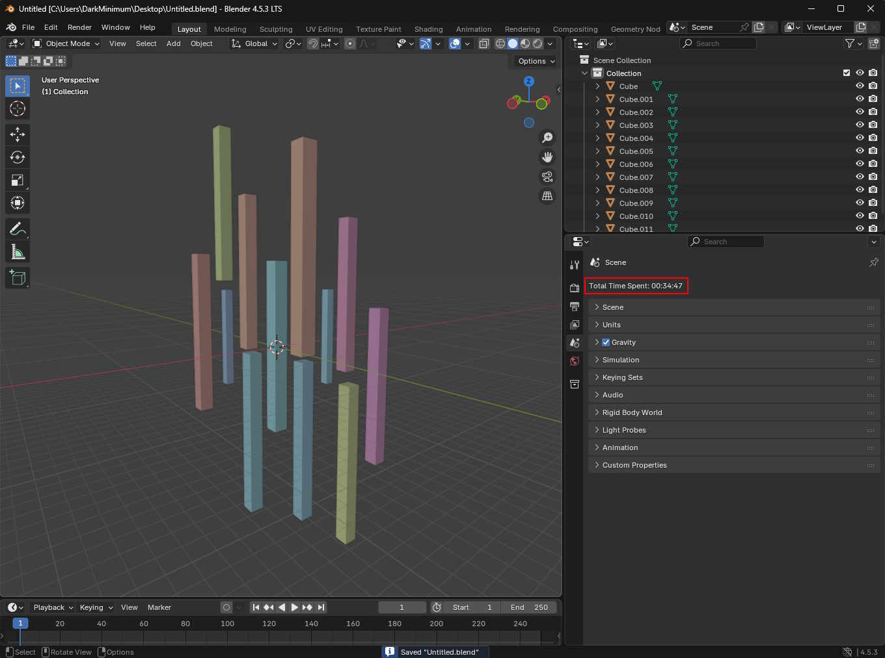
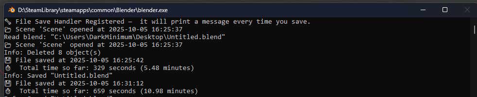

## About

TrackMe – automatically tracks the time you spend on each Blender project. Get live updates on total hours and minutes
in a dedicated panel. Perfect for productivity, logging, and workflow insights!

## Screenshots

## How to

With installed add-on, when new project created, save it somewhere. By doing so you will start time measurements for
this project. Go to Scene tab, and on the very top you will see the clock.
Each time you will save your `.blend` file - the timer will be updated automatically.

## Installation

Go to [releases page](https://github.com/DarkMinimum/TrackMe/releases) and download latest zip file.
In Blender go to `Edit->Preferences->Add-ons->Install from disk` and pick this archive.

## Feedback

If you have any feedback, please reach out to me at danil.grechishkin@gmail.com ;)

